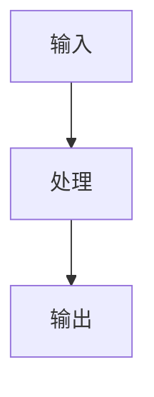

<!--
---
type: workflow
slug: long-form-pipeline
title: 长文写作完整流水线(博客 + 多平台)
emoji: ✍️
solves_scenario: long-form-writing
roles:
  - creator
  - founder
  - marketer
  - developer
tools_required:
  - claude
  - deepseek
  - gemini
  - midjourney
  - obsidian
time_investment: 4-8 小时(一篇 5000-10000 字深度长文)
output: 一篇博客 + 公众号 / 知乎 / X 改编版 + 配套图
status: verified
last_verified: 2026-05-26
next_review: 2026-08-26
---
-->

# ✍️ 长文写作完整流水线(博客 + 多平台)

> 一篇深度长文从"灵感"到"多平台发布"的完整工作流。**自媒体 / 创业者 / 知识工作者通用**。

---

## 这个工作流解决什么

详见 [→ 场景:写长文 / 博客](../scenarios/long-form-writing.md)。

简化重述:你想:
- 写**一篇深度文章**(5000-10000 字)而不是水内容
- 同步发到**多个平台**(博客 / 公众号 / 知乎 / X / LinkedIn)
- 每个平台有不同口味,要**单独适配**而不是粘贴
- 有**配套图 / 封面**而不是裸文字
- 整个过程**1 天而不是 1 周**

---

## 工具栈

| 阶段 | 工具 | 必备 / 可选 |
|------|------|:----------:|
| **选题 / 调研** | [Gemini Deep Research](../tools/foundation-models/gemini.md) / [Kimi 探索版](../tools/foundation-models/kimi.md) / [秘塔](../tools/research/mita.md) | 必备(选 1-2)|
| **大纲** | [Claude Sonnet 4.7](../tools/foundation-models/claude.md) / [DeepSeek](../tools/foundation-models/deepseek.md) | 必备 |
| **正文写作** | Claude / DeepSeek + 你 | 必备(你为主)|
| **配图 / 封面** | [Midjourney V7](../tools/image-gen/midjourney.md) / [FLUX](../tools/image-gen/flux.md) / [即梦](../tools/image-gen/jimeng.md) | 必备 |
| **流程图 / 架构图** | Mermaid(任意 markdown 渲染) | 可选 |
| **多平台改编** | Claude / DeepSeek | 必备 |
| **沉淀 / 长期管理** | [Obsidian](../tools/notes/obsidian.md) / Notion | 必备 |

---

## 完整流程总览

```
Step 1  ─ 选题 ──────────► AI 帮你筛 / 验证 / 评估
Step 2  ─ 调研 ──────────► Deep Research / 探索版搜全网
Step 3  ─ 大纲 ──────────► AI 出骨架 + 你确认核心论点
Step 4  ─ 正文 ──────────► 你为主 + AI 辅助(分段 polish)
Step 5  ─ 图 / 流程图 ────► Midjourney + Mermaid
Step 6  ─ Self-Review ───► AI 模仿严苛读者挑刺
Step 7  ─ 多平台改编 ─────► 同一内容 → 不同口味
Step 8  ─ 发布 + 沉淀 ────► 多平台 + Obsidian 归档
```

**总耗时**:深度长文 4-8 小时(传统手做 2-4 天)。

---

## Step 1:选题(从 10 个选 1 个)

**工具**:Claude / DeepSeek

写好文章 80% 在选题。

**Prompt**:

```
我是 [自我描述,如:11 年后端 + 4 年 Web3 / 资深 PM / 设计师] 。
我的目标读者是 [具体描述]。
我擅长 [领域]。

我有以下 10 个候选选题:
1. ...
2. ...
...

帮我评估每个:
- 读者关心度(1-10)
- 我的差异化优势(1-10)
- 写作难度(1-10)
- 时效性(常青 / 短期 / 过气)
- 改编多平台的潜力(高 / 中 / 低)

最后推荐 2-3 个,说理由。我做最终决定。
```

⚠️ **关键**:让 AI 评估你的"**差异化优势**"。
- 同类话题已经 100 人写过 → 价值低
- 你**独有的经验 / 视角 / 数据** → 高
- 选高的写,不要追热点跟风。

---

## Step 2:调研(广度 + 深度)

**工具**:Gemini Deep Research(海外)/ Kimi 探索版(国内)

### 2a. Gemini Deep Research(海外身份)

```
我要写一篇关于 [选题] 的深度长文。
预期读者:[具体描述]。
我已知道的:[列出你已经懂的部分]。

帮我深度调研:

1. 这个话题"业内已经讨论到什么深度"(找 5-10 篇代表性文章)
2. 哪些角度被讨论烂了?哪些角度还没人写?
3. 最新 6 个月内的关键事件 / 数据 / 论文
4. 主要的争议点(立场 A / 立场 B 各有什么人 / 论据)
5. 给我一份"参考资料清单"(权威性 + 时效性都要)

最后输出综述,5000-10000 字,带引用源。
```

→ 跑 30-60 分钟,出综述 + 参考源清单。

### 2b. Kimi 探索版(国内 / 中文话题)

```
我要写关于 [选题] 的中文长文。

帮我搜索 + 整理:
1. 中文圈内 5-10 篇优质讨论(知乎 / 公众号 / 博客)
2. 微博 / 推特等社交平台的"民间观点 / 段子"
3. 国内主流媒体的报道
4. 国内圈内 KOL 的观点
5. 哪些数字 / 数据可能被引用

输出一份带链接的资料清单。
```

### 2c. 收尾:用 NotebookLM 消化

把 Step 2a/2b 的资料 + 你已有的笔记 → 上传到 [NotebookLM](../tools/research/notebook-lm.md)。
- 让它帮你交叉对比
- 听一遍它生成的"AI 播客版总结"(开车通勤时听)
- 你**对话题的整体认知**这一步建立

---

## Step 3:大纲(骨架 + 核心论点)

**工具**:Claude Sonnet 4.7(写作首选)

**Prompt**:

```
我要写一篇关于 [选题] 的长文。

我的"独家观点"是:[1-3 句话核心论点 — 这是你写文章的灵魂]。

我看了 [Step 2 调研出来的资料,链接列表]。

帮我出一个大纲:
1. **标题候选**(3-5 个,各自的"刺点" + 适合的平台)
2. **TL;DR**(150 字内,先把核心结论说清)
3. **章节结构**(5-8 个 H2,每个 1 句话主旨)
4. **关键数据 / 事实 / 引用**(每章应该有什么证据)
5. **配图建议**(每章建议什么图 / 流程图)
6. **结尾应该留下什么**(行动 / 思考 / 余味)

要求:
- 不要"首先 / 其次 / 综上"塑料结构
- 每章必须有"信息密度"(读者读完能拿走什么)
- 假设读者是 [具体画像],不要太基础也不要太专业
```

**预期产出**:
- 你 review 大纲
- **关键判断**:这个大纲能不能让读者"读完点头"?如果不能,改大纲再开始写

⚠️ **这一步至少花 30 分钟,反复迭代**。**写得多 = 好文章,写得多 ≠ 好大纲**。

---

## Step 4:正文(你为主,AI 辅助)

**工具**:Claude Sonnet 4.7 / DeepSeek + 你的 IDE / Obsidian

### 4a. 第一稿:分段写

**不要让 AI 一气呵成写完整篇** —— 那样:
- 风格统一但**没有你的灵魂**
- AI 会"水"中间几节
- 读者读两段就感觉是 AI 写的

**正确姿势**:**每章一个 prompt**。

```
[章节标题]

主旨:[这章要讲清楚什么]
要包含:
- [关键论点 1]
- [关键论点 2]
- [关键引用 / 数据]

要求:
- 800-1500 字
- 不要"首先 / 其次 / 综上"
- 中文,口语化但不油腻
- 每段 < 4 行
- 关键判断要有具体例子支撑
- 不要"作为 AI 的客观分析" — 直接表达立场

我会基于你出的草稿改 30-50%,所以**不需要完美**,要"有信息密度 + 我能改的素材"。
```

→ 出每章草稿 → **你改 30-50%**(加你的经验 / 例子 / 立场)。

### 4b. 第二稿:整篇通读

整篇拼起来后,扔给 AI 看一遍:

```
这是我的初稿:[完整正文]

帮我做一次"reader 视角"审稿:

1. 阅读体验问题:
   - 哪里读得"卡"?
   - 哪段过渡不顺?
   - 哪里突然变难懂?
2. 论证问题:
   - 哪里论点跳跃?(A 直接到 B 缺论据)
   - 哪里举例不充分?
3. 风格问题:
   - 哪里"AI 味"重?(塑料感 / 模板化)
   - 哪里有重复 / 啰嗦?
4. 结构问题:
   - 哪几段顺序可以换更好?
   - 有没有可以合并 / 拆分的章节?

每条找出来 + 给具体建议。
```

→ 你过一遍 → 改 → 出第二稿。

### 4c. 第三稿:你自己 polish

最后 30 分钟,**关掉 AI**,自己读一遍:
- 找你的"声音"(AI 不会有的口头禅 / 节奏)
- 加你独有的故事 / 例子
- 标点 / 节奏 / 排版

---

## Step 5:配图 / 流程图

**工具**:Midjourney(海外)/ FLUX(国内)/ 即梦(国内零成本)+ Mermaid

### 5a. 封面图

```
prompt 给 Midjourney V7:

[文章主题的视觉描述,具体场景]
+ 风格指令(电影感 / 极简 / 复古 / 科技感)
+ --ar 16:9(博客头图)或 --ar 4:3(公众号)
+ --sref [你的系列 sref URL,保持品牌一致]
```

如果有"系列内容"概念,**用 Style Reference 保持封面图风格一致**(博客整体审美)。

### 5b. 配图 / 章节图

每个 H2 章节配 1 张图:
- Midjourney 出概念图
- 即梦出"中国元素"图
- FLUX 出真实感商业图

### 5c. 流程图 / 架构图

Mermaid:



让 AI 帮你写 Mermaid:

```
我的文章里有个流程:
[描述]

给我一份 mermaid 图,要求:
- 简洁不超过 10 个节点
- 中文标签
- 关键路径加颜色
- markdown 直接渲染
```

⚠️ **图比文字密度高 5-10 倍**。**好的长文一定有图**。

---

## Step 6:Self-Review(假装严苛读者)

**工具**:Claude / GPT-5 Pro

```
你扮演一个**对作者严苛但不刻薄的资深读者**。

读这篇文章:[完整版]

挑刺(不要客气,但要建设性):

1. **如果我不认同这个文章核心论点,我会怎么反驳?**
   - 列 3 个最强反对论据
   - 文章是否回应了它们?
2. **哪一段读着读着我会"关掉网页"?为什么?**
3. **哪个例子 / 引用 不够强 / 不够新?**
4. **如果用一句话黑这篇文章,你会说什么?**
5. **如果用一句话夸,你会说什么?**

我希望文章经得住"恶意读者"考验。
```

这一步**会发现一些你自己看不到的问题**。改一改再发。

---

## Step 7:多平台改编(同内容 → 不同口味)

**工具**:Claude / DeepSeek

**核心理念**:**每个平台读者期望不同,粘贴必死**。
- **博客 / 个站**:完整版,深度 + 长 + 结构化
- **公众号**:中长 + 故事化 + 排版美 + 配图多
- **知乎**:中长 + 论证更密 + 引用更全 + 抖灵气
- **X / Twitter**:短 + 数 + 钩子(thread 形式)
- **LinkedIn**:中短 + 商业角度 + 个人 reflection
- **小红书**:**Web3 / 加密话题不发**(基于 Frank 个人经验已两次违规)

### 7a. 博客 / 个站

直接发完整版(已经写好)。

### 7b. 公众号改编

```
这是我博客的完整版:[贴]

帮我改编成公众号版:
- 长度:3000-5000 字(博客原版可能 8000+ 字)
- 删:过于专业的术语 + 部分技术细节
- 加:更多故事性 + 更多排版小标题 + 更多 emoji 但克制
- 保留:核心论点 + 关键数据
- 风格:像跟读者聊天,不要像写论文

输出:可以直接粘进公众号编辑器的 markdown。
```

### 7c. 知乎改编

```
帮我改成知乎版:
- 假设读者是 [画像]
- 知乎读者偏好:论据扎实 + 引用源 + 抖灵气 + 反常识观点
- 长度 3000-6000 字
- 加 1-2 个"我的反常识观点"放前面(钩子)
- 引用源要列(知乎读者会查)
```

### 7d. X / Twitter Thread

```
帮我改成 X thread(英文,如适用):
- 10-15 tweets
- 第一 tweet 是钩子(让人想继续读)
- 每条 tweet < 280 字符
- 关键数据 / 图放在中段(高互动)
- 最后 tweet 是 CTA(关注 / 链接 / 讨论)
```

### 7e. LinkedIn 改编

```
帮我改成 LinkedIn post(英文):
- 800-1500 字
- 商业 / 职业角度切入
- 从"个人 reflection"开头(LinkedIn 读者吃这一套)
- 中间结构化(用项目符号)
- 结尾 CTA + 互动问题
```

⚠️ **每个平台单独 prompt + 单独 review**。
**不要让一个 prompt 出 5 个平台版本** — 质量会全部下降。

---

## Step 8:发布 + 沉淀

### 8a. 发布顺序(可选最佳实践)

```
Day 1 上午:博客 / 个站发布
Day 1 下午:X thread 发(如果是英文受众)
Day 1 晚:公众号发(国内黄金时间)
Day 2 早:知乎(白天阅读高峰)
Day 2 晚:LinkedIn(海外受众)
```

错开发布有助于:
- 各平台的"24h 推荐"算法都吃到
- 你能基于早一天的反馈微调后面的版本
- 同一时间不会被多平台读者刷屏

### 8b. 沉淀到 Obsidian / Notion

最重要的一步:**把这次写作"产出"留下来**。

```
我的内容库 / 长文/<YYYY-MM-DD>-<title>/
  ├── outline.md           (Step 3 大纲)
  ├── research-notes.md    (Step 2 调研笔记)
  ├── draft-v1.md          (Step 4a 第一稿)
  ├── final.md             (Step 4c 最终稿)
  ├── platforms/
  │   ├── wechat.md
  │   ├── zhihu.md
  │   ├── twitter-thread.md
  │   └── linkedin.md
  ├── images/
  └── self-review.md       (Step 6 反馈)
```

**为什么沉淀重要**:
- 下次写类似话题:复用调研 + 大纲套路
- 6 个月后回看:学习自己进步
- 长文是**长期资产**,沉淀 = 复利

---

## 时间和成本

```
Step 1:选题                30 分钟
Step 2:调研                30-90 分钟(Deep Research 后台跑)
Step 3:大纲                30-60 分钟
Step 4:正文(你为主)       2-4 小时
Step 5:配图 / 流程图        30 分钟
Step 6:Self-Review          15 分钟
Step 7:多平台改编           30-60 分钟(每平台 10-15 分钟)
Step 8:发布 + 沉淀          30 分钟
————————————————————————————
合计:                        4-8 小时
```

**月费(海外身份)**:
- Claude Pro $20
- Gemini AI Premium $20(Deep Research + 视频)
- Midjourney Standard $30
- 总:$70

**月费(国内)**:
- DeepSeek API ¥30
- Kimi 免费
- 即梦免费
- 沉浸式翻译 ¥19
- 总:¥50

**ROI**:
- 一篇深度长文跨平台发布
- 阅读量(我自己实测)≈ 5000-50000 跨平台
- 长期带来粉丝 / 客户 / 工作机会
- **远超月费成本**

---

## 这个工作流的边界

⚠️ **什么时候不适用**:

1. **你想写"水文 / 营销文 / SEO 农场"**
   - 这套是给"你真有想法 + 想留下作品"的人
   - 没有真东西 → AI 也救不了你
2. **极致时效性**(突发新闻 / 实时分析)
   - Step 2-3 调研流程太重,赶不上
   - 简化:直接 Kimi 探索版 30 分钟出短评 + X 发
3. **极简 / 极短**(< 1500 字)
   - 这套流程对短文 over-engineered
   - 直接 Claude / DeepSeek 一稿 + Polish 即可
4. **极敏感话题**
   - 政治 / 涉密 / 法律灰色
   - AI 会拒答 / 走偏 / 留风险
   - 这类内容要人写

---

## 真实案例

### 案例 1:[Anatomy of a $100 Meme Buy](https://blog.frankfu.cloud/posts/anatomy-of-100-dollar-meme-buy/)

- 选题(Step 1):用"反差感"主题 — 看似简单的 $100 实际成本结构
- 调研(Step 2):Gemini Deep Research 跑 1 小时,出综述
- 大纲(Step 3):Claude 出 5 章结构 + 5 张 mermaid 图位置
- 正文(Step 4):3 小时(分章 prompt + 我改 40%)
- 流程图:5 张 mermaid
- 多平台:发到博客(中文版)+ 英文 [web3-insider](https://github.com/survivorff/web3-insider)
- **总耗时 6 小时**

### 案例 2:[Hyperliquid Architecture Breakdown](https://blog.frankfu.cloud/posts/hyperliquid-architecture-breakdown/)

- 调研:Kimi 上传 hyperliquid_design 仓库 + Gemini Deep Research
- 双语(中 + 英):中文版深度,英文版简化
- 总耗时 8 小时,**vs 完全手做估计 3 工作日**

---

## 进阶变种

### 变种 A:系列内容(20+ 文章)

如果你做"X 系列"(比如"链上工程师笔记"系列):
- Step 0:**先做"系列定位文档"**(读者画像 / 风格 / 视觉系统 / 选题池)
- Step 1-7:每篇按上面流程
- **关键:用 Style Reference 保持封面图风格统一**
- **关键:每篇互相 cross-link 形成内容矩阵**

### 变种 B:中英双语并行(出海)

- Step 4 写中文版完整稿
- 复制一份让 Claude 翻成英文(不要直译,要英文母语化)
- 中英文版 Step 5-7 同时进行
- 中文发到公众号 / 知乎 / 博客中文站
- 英文发 X / LinkedIn / 英文博客
- **GitHub repo 既有中文也有英文**(SEO + 海外发现)

我自己做的就是这套(blog.frankfu.cloud + web3-insider)。

### 变种 C:配套播客 / 视频

写完文章后:
- 文章 → NotebookLM AI 播客 → 发小宇宙 / 喜马拉雅
- 文章核心点 → 5 张 PPT → Veo / Hailuo 视频(30-60 秒)
- 视频发抖音 / 小红书 / B 站

**一篇文章产出 5-10 种内容形态**,边际成本极低。

---

## 实施前的 Checklist

提交博客前自查:
- [ ] 我有"独家观点"(不是堆别人的话)
- [ ] 调研充分,引用源真的看过
- [ ] 大纲我亲自 review,不是 AI 默认骨架
- [ ] 正文每段我都改过(不是粘贴 AI)
- [ ] 配图不只是"装饰",而是"信息密度补充"
- [ ] Self-Review 我跑过,改了至少 3 处
- [ ] 多平台版我每个都看过(没出现"明显 AI 味")
- [ ] 沉淀到 Obsidian / Notion(下次复用)

---

## 相关阅读

- 场景:[→ 写长文 / 博客](../scenarios/long-form-writing.md)
- 工具:[Claude](../tools/foundation-models/claude.md) / [Gemini Deep Research](../tools/foundation-models/gemini.md) / [Midjourney](../tools/image-gen/midjourney.md) / [Obsidian](../tools/notes/obsidian.md)
- 配套场景:[选题 / 创意](../scenarios/long-form-writing.md) / [封面图](../scenarios/cover-image.md)
- 配套工作流:[content-pipeline](./content-pipeline.md)(我的完整内容流水线,含小宇宙 / 视频)

---

[← 回到所有工作流](./README.md)
